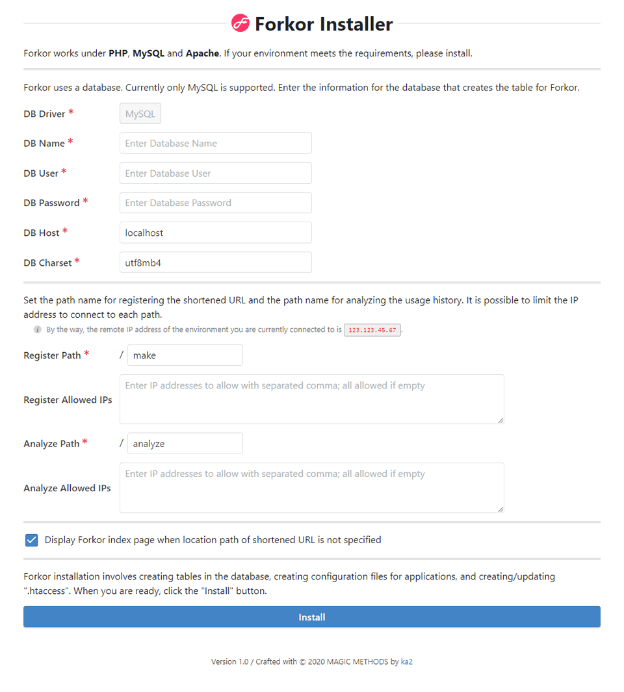

#  Forkor

## What's Forkor?

Forkor is a service that provides a shortened URL feature that allows you to redirect any URL with a short URL.

Shortened URL services are well known in the web world since they have been in use for a long time. Some of the most famous ones include "Google URL Shortener" and "Bit.ly" etc. However, the former service has already been discontinued and is not available to new users, while the latter is a paid service.
Also the use of third party shortened URL services can have the following risks.

* It becomes unavailable due to the termination or closure of that service provided.
* It becomes unusable or be restricted that service in violation of the Terms of Service.
* It is unclear whether the redirect is a trustworthy URL, which could lead to a phishing site or a source of virus infection.

Therefore, you can avoid these risks by setting up your own shortened URL service using Forkor.
You can use it permanently unless you terminate the service yourself, and there are no restrictions. Also, by using the same domain name as the host for the shortened URL, it is clear to all users that the redirected site is a URL registered and managed by that domain site, so there is no concern about the redirect destination.

Best of all, Forkor is an open-source, so it's free to use forever.

## Forkor System Requirements

The operating environment of the current version of Forkor is as follows.

* PHP (5.4 or higher required, 7.x or higher recommended)
* MySQL (5.6 or higher recommended)
* Apache (2.4 or higher recommended)
* Composer

We have not checked all versions of the middlewares to make sure it works. If it doesn't work in the environment we recommend, we're glad to let me know on Issues.

## How do I get started with Forkor

Where you want to install Forkor on your own host or domain site, you should fetch the application files. Because where the Forkor installation path becomes a shortened URL base URL, so the shortest possible name directory underneath or in the document root directory, for example.

```
$ cd {Install Path}
$ git clone https://github.com/ka215/forkor.git
$ composer install
```

Next, go to `install.php` on the Forkor installation path in your browser, please. When the installer page appears, fill in the required fields and run the installation. If the settings are correct, the necessary tables will be created in the database and all configuration files will be automatically saved.



Now you're ready to go. Easy, right?

## Features implemented

The main features of Forkor are as follows:

* When redirecting with POST method, throwing POST value as it is.
* Automatically create shortened URL within a specified string length.
* Any string can be made into a shortened URL.
* Shortened URLs are case sensitive.
* Usage logs can be recorded when redirects are made with shortened URLs.
* The usage log of registered shortened URLs can be aggregated and statistical information can be checked.
* You can control access to shortened URL registration pages and log analysis pages.

These are all available after installation.

## Customize Forkor for yourself!

More details will be forthcoming.

## Your contributions are welcome!

This application project is just the beginning. We would like to make it easier to use, improve it, and grow steadily.

* If there are any defects, malfunctions or any troubles, please let us know.
* If you have a desired function, please request it.
* Of course, making some donations will also help us.

That is why we look for your cooperation.

<iframe src="https://github.com/sponsors/ka215/button" title="Sponsor ka215" height="35" width="107" style="border: 0;"></iframe>

## Copyright and license

Code and documentation copyright 2020 the [ka2](https://ka2.org/forkor/). Code released under the [MIT License](https://raw.githubusercontent.com/ka215/forkor/master/LICENSE).
